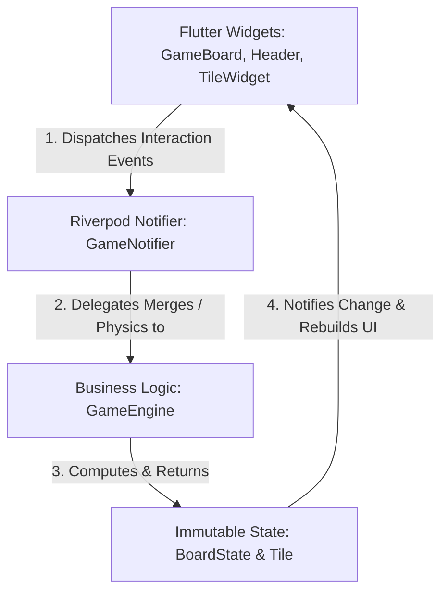

# 🎮 Gravity 2048: A Dual-Mode Physics-Inspired Flutter Game

[](https://flutter.dev)
[](https://riverpod.dev)
[](LICENSE)

A gorgeous, highly-optimized mobile puzzle game built in **Flutter**. It introduces an innovative **Gravity-Based Mode** alongside the traditional **Classic 2048 Mode**. 

Unlike most mobile games that rely on heavy engine frameworks like *Flame*, this project was designed from the ground up to utilize **Flutter's native animation system** (`AnimatedWidget` and Explicit Animations) to guarantee smooth 60 FPS performance, a featherweight installation footprint, and high-fidelity transitions.

---

## 🎥 Gameplay Preview

<div align="center">
  <video src="doc/example.mp4" width="100%" max-width="800px" controls autoplay loop muted></video>
</div>

---

## ✨ Key Features

### 🌌 1. Gravity Mode (Columns Drop & Merge)
Experience a physics-infused twist on the classic 2048 formula:
*   **Column-Based Drops**: Guide descending tiles into specific columns by dragging or tapping.
*   **Landing Detection Physics**: An intelligent landing grid system dynamically calculates falling paths and final column rows.
*   **Recursive Chain Reactions**: Dropped tiles automatically cascade and merge both horizontally and vertically, setting off satisfying chain-reaction mergers until the board stabilizes.
*   **Boundary Warning System**: If tiles stack up and cross the threshold boundary row, it's game over!

### 🎲 2. Classic 2048 Mode
For the purists:
*   **Standard Swipe Mechanics**: Smoothly swipe in four directions to shift and slide tiles.
*   **Authentic Merge Logics**: Familiar merging mathematics with randomized value spawn points.
*   **Intelligent End-Game Check**: Actively parses remaining legal moves to determine gridlock.

### 🔄 3. State Preservation & Persistence
*   Seamlessly toggle between **Classic** and **Gravity** modes mid-game without losing your scores or current board configuration.
*   Powered by a lightweight, key-value storage system utilizing **Hive** for fast offline caching.

---

## 🏗️ Architectural Overview

The application is architected around a strict **unidirectional data flow** ensuring zero side-effects and extreme testability:



### Core Architecture Components:
1.  **UI layer (`lib/ui`)**: Responsive Flutter widget structure including a grid board, sliding header dashboards, and custom tile elements.
2.  **State Management (`lib/state`)**: Powered by **Riverpod `NotifierProvider`**, handling granular events like `dropTile()`, `toggleMode()`, and `swipe()`.
3.  **Logical Solver (`lib/services/game_engine.dart`)**: Mathematical solver that runs structural and gravity-based grid validations (recursive gravity collapses, swipe merges, landing lookups).
4.  **Immutable Models (`lib/models`)**: Built utilizing pure immutable data classes with deep cloning capability (`copyWith`), ensuring robust state transitions.

---

## ⚡ Custom Native Animation Engine

Instead of bundling heavy game engine overhead, this project achieves premium fluid animations using Flutter's native framework:
*   **Explicit Animations**: Handles fine-grained control over tile transitions, drop acceleration, and scale-up merges.
*   **Lag-Free Rendering**: Uses native platform composition ensuring animations run directly on the thread without bottlenecking.
*   **Dynamic Layout Calculations**: Employs `LayoutBuilder` coordinates to calculate exact column boundary boxes on the fly, rendering drags extremely precise.

---

## 🛠️ Tech Stack & Dependencies

*   **Framework**: [Flutter](https://flutter.dev) (Dart SDK `>=3.0.3`)
*   **State Management**: [Riverpod (3.x)](https://riverpod.dev) for reactive state updates.
*   **Local Caching**: [Hive](https://pub.dev/packages/hive) key-value storage database.
*   **Gesture Recognizer**: [Flutter Swipe Detector](https://pub.dev/packages/flutter_swipe_detector).
*   **Asset Bundler**: Explicit asset and standard vector setups.

---

## 🚀 Getting Started & Setup

### Prerequisites
Make sure you have the [Flutter SDK installed](https://docs.flutter.dev/get-started/install) on your system.

### Installation

1.  **Clone the repository:**
    ```bash
    git clone https://github.com/your-username/gravity-2048.git
    cd gravity-2048
    ```

2.  **Install dependencies:**
    ```bash
    flutter pub get
    ```

3.  **Run build runner (to compile state generation if required):**
    ```bash
    flutter pub run build_runner build --delete-conflicting-outputs
    ```

4.  **Launch the application in Dev mode:**
    ```bash
    flutter run
    ```

### Production Build

*   **Build Android APK:**
    ```bash
    flutter build apk --release
    ```
*   **Build iOS App Bundle:**
    ```bash
    flutter build ipa --release
    ```

---

## 📄 License

This project is licensed under the MIT License - see the [LICENSE](LICENSE) file for details.
