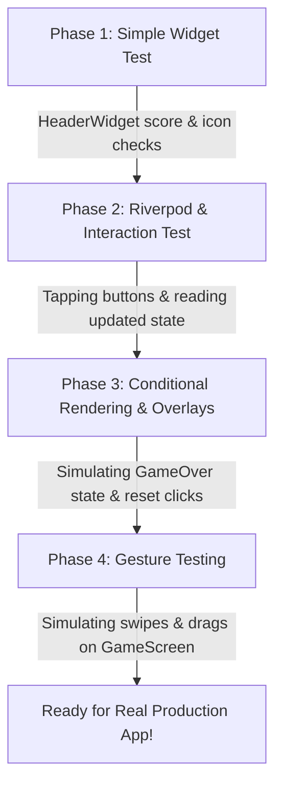

# 🧪 Flutter Widget Testing in the Age of AI: A Step-by-Step Guide

Welcome! This guide is designed to help you master **Flutter Widget Testing** using a structured, step-by-step approach. We will use this game (**Gravity 2048**) as a lightweight, interactive sandbox to learn concepts, and then prepare you to implement testing in a real production application.

---

## 🤖 Part 1: How to Learn and Write Widget Tests with AI

AI coding assistants (like Gemini, Antigravity, Copilot, etc.) are extremely powerful for writing tests because tests follow structured, repetitive patterns. However, AI can sometimes hallucinate widget states or struggle with complex state management like Riverpod.

### 💡 Best Prompts to use with AI for Widget Testing

When asking an AI to write or debug widget tests, use these structures:

#### 1. The "Component Context" Prompt
To get a test generated for a widget, provide both the widget's code and its parent state context.
```text
I want to write a Flutter widget test for the following widget:
[Paste Widget Code here]

It reads state from this Riverpod Provider:
[Paste Provider/State definition here]

Generate a widget test that:
1. Wraps the widget inside a ProviderScope.
2. Checks that initial values are rendered correctly.
3. Simulates a tap on the button and verifies the notifier method [methodName] is called.
Please write clean, idiomatic Flutter test code.
```

#### 2. The "Explain This Test Failure" Prompt
If a test fails, feed the error message and the test code to the AI.
```text
My Flutter widget test is failing with the following error:
[Paste error output here]

Here is the test code:
[Paste test code here]

Explain why it is failing (e.g., is it an animation issue, missing ProviderScope, or incorrect finder?) and provide the corrected test code.
```

---

## 🧱 Part 2: Widget Testing Fundamentals

Flutter widget tests run in a fast, headless environment. They do not run on a real device or emulator, meaning they are incredibly fast (seconds, not minutes).

### The Three Pillars of a Widget Test:
1. **Finders (`find`)**: Locate widgets in the widget tree (e.g., `find.text('0')`, `find.byIcon(Icons.settings)`).
2. **Actions (`tester`)**: Interact with widgets (e.g., `tester.tap()`, `tester.drag()`, `tester.pump()`).
3. **Assertions (`expect`)**: Verify if the UI matches expectations (e.g., `expect(finder, findsOneWidget)`).

### Essential Test Lifecycle Methods:
*   `tester.pumpWidget(Widget widget)`: Mounts/renders the widget tree in the test environment.
*   `tester.pump()`: Triggers a single frame redraw (used to build widgets after state changes).
*   `tester.pumpAndSettle()`: Repeatedly pumps frames until there are no more scheduled frame changes (used for animations or page transitions). **Warning:** If you have an infinite loop animation, `pumpAndSettle` will time out!

---

## ⚡ Part 3: Testing Riverpod-based Widgets

Since Gravity 2048 uses Riverpod for state management (`gameStateProvider` and `GameNotifier`), standard widget tests will throw errors if they don't have a `ProviderScope`.

### The Pattern:
```dart
import 'package:flutter/material.dart';
import 'package:flutter_test/flutter_test.dart';
import 'package:flutter_riverpod/flutter_riverpod.dart';
import 'package:flutter_2048/ui/components/header.dart';
import 'package:flutter_2048/state/game_state_notifier.dart';

void main() {
  testWidgets('HeaderWidget displays the score and reacts to toggle button', (WidgetTester tester) async {
    // 1. Mount the widget inside a ProviderScope
    await tester.pumpWidget(
      const ProviderScope(
        child: MaterialApp(
          home: Scaffold(
            body: HeaderWidget(),
          ),
        ),
      ),
    );

    // 2. Assert initial UI state (score should be 0 initially)
    expect(find.text('0'), findsOneWidget);

    // 3. Find the settings button (Switch to Classic/Gravity Mode tooltip)
    final toggleButton = find.byType(IconButton);
    expect(toggleButton, findsOneWidget);

    // 4. Simulate action
    await tester.tap(toggleButton);
    await tester.pump(); // Redraw UI after state change

    // 5. Assert that state changed or notifier action ran successfully
  });
}
```

---

## 🗺️ Part 4: Gravity 2048 Practice Roadmap

Here is how we will structure our learning path inside this codebase. We will build tests for these components one by one:



---

## 📋 Part 5: Step-by-Step TODO Checklist

Follow this checklist to learn and implement tests on this project. 

- [ ] **Step 0: Verify Test Environment**
  - Run `flutter test` in terminal. It should run successfully with 0 tests.
- [ ] **Step 1: Test `HeaderWidget` (Basic Widgets & Providers)**
  - Create `test/ui/components/header_widget_test.dart`.
  - Write a test to verify that the score is printed.
  - Write a test to tap the toggle mode button and ensure it calls the provider notifier.
- [ ] **Step 2: Test `GameOverOverlay` (Conditional Rendering)**
  - Create `test/ui/game_screen_test.dart`.
  - Mock/Override `gameStateProvider` to return a state where `gameOver` is `true`.
  - Verify that the 'GAME OVER' screen appears.
  - Tap the 'Play Again' button and verify that the reset method gets triggered.
- [ ] **Step 3: Test `GameBoardWidget` and `TileWidget` (List & Grid Layouts)**
  - Create `test/ui/components/game_board_test.dart`.
  - Verify that a grid is rendered.
  - Verify that active/settled tiles from the state are drawn at correct positions.
- [ ] **Step 4: Test Swiping & Gestures (Advanced User Actions)**
  - Simulate horizontal swipes (drag gestures) and verify that they result in game engine swipe logic calls.

---

## ⚠️ Part 6: Troubleshooting & Common Pitfalls

1. **"A RenderFlex overflowed by..." errors in tests:**
   - Test environments have a default screen size of 800x600 pixels.
   - If widgets are too large, set a custom viewport size before running the test:
     ```dart
     tester.view.physicalSize = const Size(1080, 1920);
     tester.view.devicePixelRatio = 1.0;
     addTearDown(tester.view.resetPhysicalSize);
     ```
2. **Animations not finishing:**
   - If a widget runs an infinite loading spinner or animation, `tester.pumpAndSettle()` will throw a timeout error.
   - Use `tester.pump(Duration(milliseconds: 100))` instead to advance the animation by a small steps.
3. **Hive Database errors:**
   - If the codebase queries Hive storage during widget instantiation, you should mock Hive boxes or initialize Hive in a temporary directory using `setUp()` and clean up in `tearDown()`.
